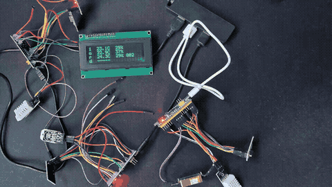

stm32f103 (bluepill) application using nRF24l01 radio module.

Adapts code from:  
https://github.com/controllerstech/NRF24L01 
https://controllerstech.com/temperature-measurement-using-dht22-in-stm32 
https://github.com/StanislavLakhtin/stm32-mh-z19 
 
 

